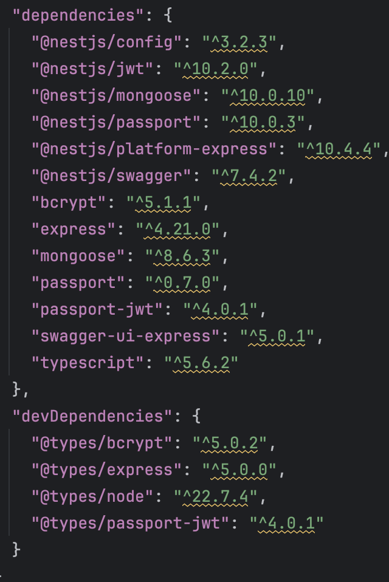

University: [ITMO University](https://itmo.ru/ru/)\
Faculty: [FICT](https://fict.itmo.ru)\
Course: [Application containerization and orchestration](https://github.com/itmo-ict-faculty/application-containerization-and-orchestration)\
Year: 2023/2024\
Group: K4113c\
Author: Komarov Alexey Nikolaevich\
Practice: practice1\
Date of create: \
Date of finished: \

## Описание
Это первая практическая работа "Контейнеризация микросервисных приложений"

## Цель работы
Данная работа предназначена для изучения и практического применения технологии контейнеризации при разработке микросервисных приложений.

## Ход работы

1. Был создан проект на node.js: nest для бэка и react для фронта

  

2. Зависимости в ноде автоматически собираются в package.json. Для бэка и фронта были созданы отдельные докерфайлы

  
  
   backend/Dockerfile
   ```Dockerfile
    FROM node:18
    WORKDIR /usr/src/app
    COPY package*.json ./
    RUN npm install
    COPY .. .
    RUN npm run build
    EXPOSE 3000
    CMD ["npm", "run", "start:prod"]

   ```
   frontend/Dockerfile
   ```Dockerfile
    FROM node:16 AS build
    WORKDIR /app
    COPY package*.json ./
    RUN npm install
    COPY . .
    RUN npm run build

    FROM nginx:alpine
    COPY --from=build /app/build /usr/share/nginx/html
    EXPOSE 80
    CMD ["nginx", "-g", "daemon off;"]
   ```

   
Были созданы образы этих приложений
     ```cmd
     docker build -t backend .
     ```   
     ```cmd
     docker build -t frontend .
     ```   
   
3. Запустить, приложить доказательства работы приложения.  
   ```cmd
   docker-compose up -d
   ```
   
   
    
