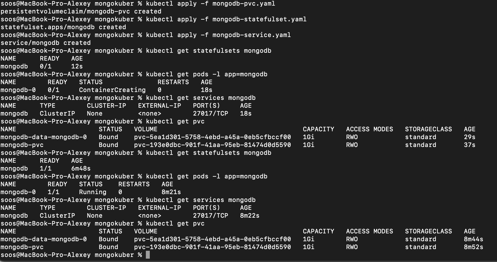

University: [ITMO University](https://itmo.ru/ru/)\
Faculty: [FICT](https://fict.itmo.ru)\
Course: [Application containerization and orchestration](https://github.com/itmo-ict-faculty/application-containerization-and-orchestration)\
Year: 2023/2024\
Group: K4113c\
Author: Komarov Alexey Nikolaevich\
Practice: practice2\
Date of create: \
Date of finished: \

## Описание
Это вторая практическая работа "Базы данных в микросервисных архитектурах"  

## Цель работы
Данная практическая работа направлена на изучение принципов работы с базами данных в контексте микросервисных приложений.  

## Ход работы  

1. Изучить роль баз данных в микросервисной архитектуре.  

2. Для работы была выбрана БД Mongo. Был создан PVC, StatefulSet и Service
    2.1. Манифест для PVC
   ```yaml
   apiVersion: v1
    kind: PersistentVolumeClaim
    metadata:
      name: mongodb-pvc
    spec:
      accessModes:
        - ReadWriteOnce
      resources:
        requests:
          storage: 1Gi
   ```
   2.2 Манифест для StatefulSet
   ```yaml
   apiVersion: apps/v1
    kind: StatefulSet
    metadata:
      name: mongodb
    spec:
      serviceName: mongodb
      replicas: 1
      selector:
        matchLabels:
          app: mongodb
      template:
        metadata:
          labels:
            app: mongodb
        spec:
          containers:
          - name: mongodb
            image: mongo:latest
            ports:
            - containerPort: 27017
            volumeMounts:
            - name: mongodb-data
              mountPath: /data/db
      volumeClaimTemplates:
      - metadata:
          name: mongodb-data
        spec:
          accessModes: [ "ReadWriteOnce" ]
          resources:
            requests:
              storage: 1Gi  
   ```
   2.3 Манифест для Service
   ```yaml
   aapiVersion: v1
    kind: Service
    metadata:
      name: mongodb
    spec:
      clusterIP: None
      selector:
        app: mongodb
      ports:
      - port: 27017
        targetPort: 27017
   ```
   2.4. Поднимаем все это в minikube
   ```cmd
    kubectl apply -f mongodb-pvc.yaml
    kubectl apply -f mongodb-statefulset.yaml
    kubectl apply -f mongodb-service.yaml
   ```  
   2.5. Проверем работу пода
   ```cmd
    kubectl get pods
   ```  
    
