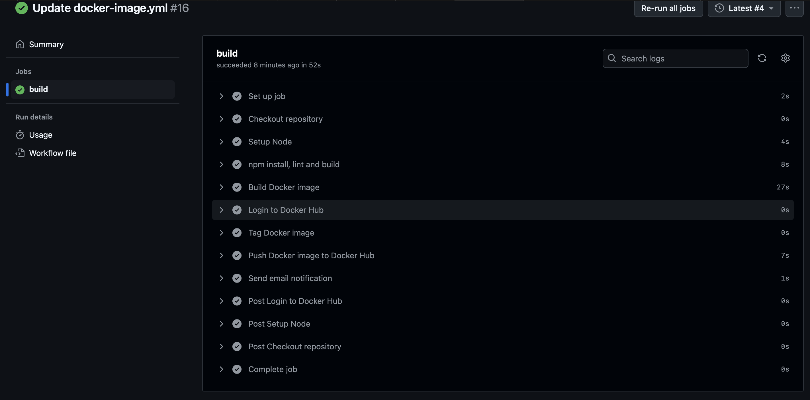
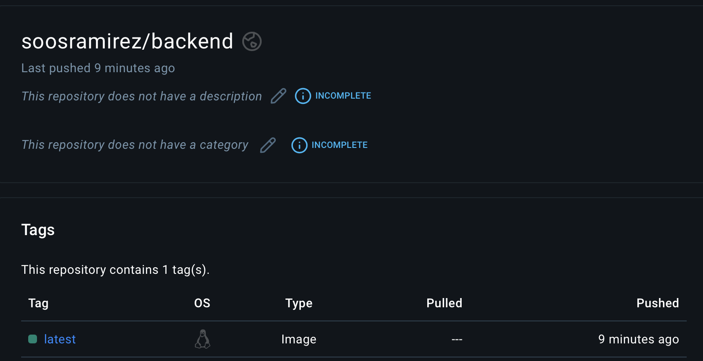
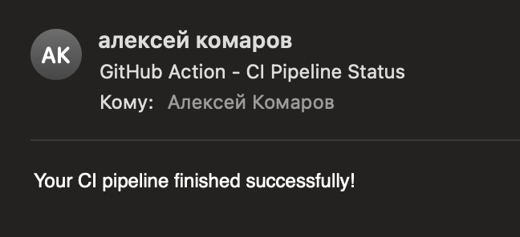

University: [ITMO University](https://itmo.ru/ru/)\
Faculty: [FICT](https://fict.itmo.ru)\
Course: [Application containerization and orchestration](https://github.com/itmo-ict-faculty/application-containerization-and-orchestration)\
Year: 2023/2024\
Group: K4113c\
Author: Komarov Alexey Nikolaevich\
Practice: practice3\
Date of create: \
Date of finished: \

## Описание
Это третья практическая работа "Развертывание инструментов Ci/Cd для тестового проекта"

## Цель работы
Данная практическая работа предполагает установку и настройку специальных инструментов, которые помогут автоматизировать процесс тестирования и развертывания программного обеспечения.

## Ход работы  
1. Изучить основные идеи Continuous Integration (CI) и Continuous Deployment (CD) - методы для ускорения и улучшения качества разработки.
   Был написан yml файл с настройками пайплайна

   ```yaml
    name: lint, build Docker image, and push to Docker Hub

    on:
      push:
        branches:
        - main

    jobs:

      build:

        runs-on: ubuntu-latest

        steps:
        - name: Checkout repository
          uses: actions/checkout@v4

        - name: Setup Node
          uses: actions/setup-node@v4
          with:
            node-version: '21.7.1'
        
        - name: npm install, lint and build
          run: |
            cd backend
            npm install
            npm run lint
            npm run build
        - name: Build Docker image
          run: docker build -t backend ./backend

        - name: Login to Docker Hub
          uses: docker/login-action@v3
          with:
            username: ${{ secrets.DOCKERHUB_USERNAME }}
            password: ${{ secrets.DOCKERHUB_TOKEN }}
        
        - name: Tag Docker image
          run: docker tag backend "soosramirez/backend:latest"

        - name: Push Docker image to Docker Hub
          run: docker push "soosramirez/backend:latest"

        - name: Send email notification
          uses: dawidd6/action-send-mail@v3
          with:
            server_address: smtp.gmail.com
            server_port: 587
            username: ${{ secrets.MAIL_LOGIN }}
            password: ${{ secrets.MAIL_PASSWORD }}
            subject: GitHub Action - CI Pipeline Status
            body: Your CI pipeline finished successfully!
            to: alex.komarov.2001@yandex.ru
            from: mrsoosramirez@gmail.com
            content_type: text/plain
   ```

2. Теперь при пуше в main выполняется данный пайплайн
      
      
    

## Результат
1. Метод ветвления был выбран Central Workflow. Данный метод хорошо подходит в тех случаях, когда на проекте один разработчик.
2. Чтобы улучшить данный пайплайн, можно было бы добавить автотесты. 

